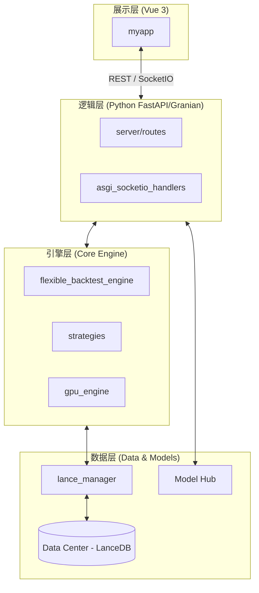

# Aquatrade 量化交易平台

Aquatrade 是一个高性能、事件驱动的量化交易与回测平台。它专为灵活性和速度而设计，利用现代技术栈（如 LanceDB 进行存储，Polars 进行高效数据处理），并支持 CPU 和 GPU 高度并行的计算优化。

---

## 🏗️ 系统架构

本项目采用分层解耦设计，确保核心引擎、数据流与展示层的独立演进。



---

## 📂 目录结构全解析

| 目录 | 模块名称 | 描述 |
|:---|:---|:---|
| `core/` | **核心引擎** | 包含回测逻辑 (`backtest/`)、策略实现 (`strategies/`) 及计算优化。 |
| `data/` | **[NEW] 数据中心** | 统一管理数据库 (`database/`)、Parquet文件、爬虫数据及报告。 |
| `models/` | **[NEW] 模型中心** | 包含微调工具 (`finetune_hub/`)、训练数据及各版本权重。 |
| `data_svc/` | **数据服务** | 封装 `lance_manager` 持久化逻辑及上游爬虫 (`spider/`)。 |
| `server/` | **后端 API** | 基于 FastAPI/Granian，处理 API 路由与 WebSocket 实时流。 |
| `myapp/` | **前端应用** | Vue 3 + Vite 构建的现代化交互界面。 |
| `logs/` | **[NEW] 日志仓** | 存储系统运行日志 (`debug.log`)、错误栈及迁移日志。 |
| `sandbox/` | **开发者沙盒** | 存放临时测试脚本、Debug 工具，保持主轴目录整洁。 |
| `config/` | **配置中心** | `config.py` 管理全局动态路径及环境参数。 |

---

## 💾 数据中心 (Data Center)

项目采用 **"Code-Data Separation" (码数分离)** 原则。所有的持久化数据均在 `data/` 目录下集中管理。

### 混合存储架构 (2020年分界线)

```
📊 热数据层 (QuestDB)      → 2020-至今   → 快速写入 + 实时查询
📦 冷数据层 (Parquet)      → 2020年之前  → 归档只读 + 极速回测
```

- **QuestDB**: 时序数据库，专为金融数据优化，支持毫秒级增量更新。
  - 基础行情表 (`base_daily`): OHLCV + 复权因子
  - 动量因子簇 (`factors_momentum`): RSI、MACD、KDJ、ATR、均线、布林带
  - 估值因子簇 (`factors_valuation`): PE、PB、市值、换手率
  - 实验因子簇 (`factors_experimental`): 涨跌停、情绪、龙头

### QuestDB 表结构详情

#### 📊 基础行情表 (`base_daily`) - 6,841,370 行
| 字段名 | 类型 | 描述 |
| :--- | :--- | :--- |
| `timestamp` | TIMESTAMP | 交易日期 (分区键) |
| `stock_code` | VARCHAR | 股票代码 (如 000001.SZ) |
| `open` | DOUBLE | 开盘价 |
| `high` | DOUBLE | 最高价 |
| `low` | DOUBLE | 最低价 |
| `close` | DOUBLE | 收盘价 |
| `volume` | DOUBLE | 成交量 (手) |
| `amount` | DOUBLE | 成交额 (元) |
| `adj_factor` | DOUBLE | 复权因子 |
| `prev_close` | DOUBLE | 昨收价 |

#### 📊 动量因子表 (`factors_momentum`) - 5,441 行
| 字段名 | 类型 | 描述 |
| :--- | :--- | :--- |
| `timestamp` | TIMESTAMP | 交易日期 (分区键) |
| `stock_code` | VARCHAR | 股票代码 |
| `rsi_14` | DOUBLE | 14日相对强弱指标 |
| `kdj_k` | DOUBLE | KDJ-K值 |
| `kdj_d` | DOUBLE | KDJ-D值 |
| `kdj_j` | DOUBLE | KDJ-J值 |
| `macd_dif` | DOUBLE | MACD-DIF (快线) |
| `macd_dea` | DOUBLE | MACD-DEA (慢线) |
| `macd_histogram` | DOUBLE | MACD柱状图 |
| `atr_14` | DOUBLE | 14日平均真实波幅 |
| `ma5` | DOUBLE | 5日均线 |
| `ma10` | DOUBLE | 10日均线 |
| `ma20` | DOUBLE | 20日均线 |
| `ma60` | DOUBLE | 60日均线 |
| `ma120` | DOUBLE | 120日均线 |
| `ma250` | DOUBLE | 250日均线 |
| `boll_upper` | DOUBLE | 布林带上轨 |
| `boll_mid` | DOUBLE | 布林带中轨 |
| `boll_lower` | DOUBLE | 布林带下轨 |
| `bias_5` | DOUBLE | 5日乖离率 |
| `bias_10` | DOUBLE | 10日乖离率 |
| `bias_20` | DOUBLE | 20日乖离率 |

#### 📊 估值因子表 (`factors_valuation`) - 6,841,370 行
| 字段名 | 类型 | 描述 |
| :--- | :--- | :--- |
| `trade_date` | TIMESTAMP | 交易日期 (分区键) |
| `stock_code` | SYMBOL | 股票代码 |
| `pe` | DOUBLE | 市盈率 (动态) |
| `pe_ttm` | DOUBLE | 市盈率 TTM |
| `pb` | DOUBLE | 市净率 |
| `ps` | DOUBLE | 市销率 |
| `ps_ttm` | DOUBLE | 市销率 TTM |
| `total_mv` | DOUBLE | 总市值 (万元) |
| `float_mv` | DOUBLE | 流通市值 (万元) |
| `turnover_rate` | DOUBLE | 换手率 (%) |
| `turnover_free` | DOUBLE | 自由流通换手率 (%) |
| `volume_ratio` | DOUBLE | 量比 |
| `dividend_yield` | DOUBLE | 股息率 (%) |

---

### Tushare API 字段映射

#### 1. `daily` 接口 → `base_daily` 表

| Tushare 字段 | 类型 | 描述 | QuestDB 字段 | 类型 | 映射说明 |
| :--- | :--- | :--- | :--- | :--- | :--- |
| `ts_code` | str | TS股票代码 | `stock_code` | VARCHAR | 格式相同，如 000001.SZ |
| `trade_date` | str | 交易日期 (YYYYMMDD) | `timestamp` | TIMESTAMP | 需转换，如 20230101 → 2023-01-01 |
| `open` | float | 开盘价 | `open` | DOUBLE | 直接映射 |
| `high` | float | 最高价 | `high` | DOUBLE | 直接映射 |
| `low` | float | 最低价 | `low` | DOUBLE | 直接映射 |
| `close` | float | 收盘价 | `close` | DOUBLE | 直接映射 |
| `pre_close` | float | 昨收价 | `prev_close` | DOUBLE | 直接映射 |
| `vol` | float | 成交量 (手) | `volume` | DOUBLE | 单位一致 |
| `amount` | float | 成交额 (千元) | `amount` | DOUBLE | **需 ×1000 转为元** |
| `change` | float | 涨跌额 | — | — | 未存储 |
| `pct_chg` | float | 涨跌幅 | — | — | 未存储 |

#### 2. `adj_factor` 接口 → `base_daily` 表

| Tushare 字段 | 类型 | 描述 | QuestDB 字段 | 类型 | 映射说明 |
| :--- | :--- | :--- | :--- | :--- | :--- |
| `ts_code` | str | TS股票代码 | `stock_code` | VARCHAR | 与 daily 一致 |
| `trade_date` | str | 交易日期 | `timestamp` | TIMESTAMP | 同上 |
| `adj_factor` | float | 复权因子 | `adj_factor` | DOUBLE | 直接映射 |

> **注意**: `adj_factor` 数据需与 `daily` 数据按 `(stock_code, trade_date)` 关联后写入。

#### 3. `daily_basic` 接口 → `factors_valuation` 表

| Tushare 字段 | 类型 | 描述 | QuestDB 字段 | 类型 | 映射说明 |
| :--- | :--- | :--- | :--- | :--- | :--- |
| `ts_code` | str | TS股票代码 | `stock_code` | SYMBOL | 直接映射 |
| `trade_date` | str | 交易日期 | `trade_date` | TIMESTAMP | 需转换 |
| `turnover_rate` | float | 换手率 (%) | `turnover_rate` | DOUBLE | 直接映射 |
| `turnover_rate_f` | float | 自由流通换手率 (%) | `turnover_free` | DOUBLE | 字段名对应 |
| `volume_ratio` | float | 量比 | `volume_ratio` | DOUBLE | 直接映射 |
| `pe` | float | 市盈率 (动态) | `pe` | DOUBLE | 直接映射 |
| `pe_ttm` | float | 市盈率 TTM | `pe_ttm` | DOUBLE | 直接映射 |
| `pb` | float | 市净率 | `pb` | DOUBLE | 直接映射 |
| `ps` | float | 市销率 | `ps` | DOUBLE | 直接映射 |
| `ps_ttm` | float | 市销率 TTM | `ps_ttm` | DOUBLE | 直接映射 |
| `total_mv` | float | 总市值 (万元) | `total_mv` | DOUBLE | 单位一致 |
| `circ_mv` | float | 流通市值 (万元) | `float_mv` | DOUBLE | 字段名对应 |
| `dv_ratio` | float | 股息率 (%) | `dividend_yield` | DOUBLE | 字段名对应 |
| `dv_ttm` | float | 股息率 TTM | — | — | 未存储 |
| `total_share` | float | 总股本 (万股) | — | — | 未存储 |
| `float_share` | float | 流通股本 (万股) | — | — | 未存储 |
| `free_share` | float | 自由流通股本 (万) | — | — | 未存储 |
| `close` | float | 当日收盘价 | — | — | base_daily 已含 |

---

### 技术指标计算说明

`factors_momentum` 表中的所有指标需基于 `base_daily` 数据计算，Tushare 不直接提供。

#### 数据准备

```python
# 复权价格计算 (建议使用后复权保持历史连续性)
adj_close = close * adj_factor
adj_open = open * adj_factor
adj_high = high * adj_factor
adj_low = low * adj_factor
```

#### 计算公式

**1. 均线 (MA)**
```
MA5  = 最近5日收盘价的算术平均值
MA10 = 最近10日收盘价的算术平均值
MA20, MA60, MA120, MA250 同理
```

**2. 乖离率 (BIAS)**
```
BIAS5  = (收盘价 - MA5) / MA5 × 100%
BIAS10 = (收盘价 - MA10) / MA10 × 100%
BIAS20 = (收盘价 - MA20) / MA20 × 100%
```

**3. RSI (14日相对强弱指标)**
```
涨幅 = max(收盘价 - 昨收, 0)
跌幅 = max(昨收 - 收盘价, 0)
平均涨幅 = 14日涨幅的 Wilder 平滑 (EMA-like, α=1/14)
平均跌幅 = 14日跌幅的 Wilder 平滑
RS = 平均涨幅 / 平均跌幅
RSI_14 = 100 - 100 / (1 + RS)
```

**4. KDJ (随机指标, 9日)**
```
LLV = 最近9日最低价的最小值
HHV = 最近9日最高价的最大值
RSV = (收盘价 - LLV) / (HHV - LLV) × 100
K值 = 2/3 × 前日K + 1/3 × RSV (首日取50)
D值 = 2/3 × 前日D + 1/3 × K值 (首日取50)
J值 = 3 × K值 - 2 × D值
```

**5. MACD (12, 26, 9)**
```
EMA12 = 收盘价的12日指数移动平均 (α=2/13)
EMA26 = 收盘价的26日指数移动平均 (α=2/27)
DIF = EMA12 - EMA26
DEA = DIF的9日指数移动平均 (α=2/10)
MACD_Histogram = (DIF - DEA) × 2
```

**6. ATR (14日平均真实波幅)**
```
TR = max(今日最高-今日最低, |今日最高-昨收|, |今日最低-昨收|)
ATR_14 = 14日TR的 Wilder 平滑
```

**7. 布林带 (20日, 2倍标准差)**
```
BOLL_MID = MA20
BOLL_UPPER = MA20 + 2 × std(20日收盘价)
BOLL_LOWER = MA20 - 2 × std(20日收盘价)
```

#### 计算注意事项

| 项目 | 说明 |
| :--- | :--- |
| 滑动窗口 | 每只股票按 `timestamp` 升序计算，注意边界 (如 RSI 需14日数据) |
| 数据量 | base_daily 684万行，需分批处理避免内存溢出 |
| 复权一致性 | 所有价格计算需使用相同的复权方式 |
| 空值处理 | 窗口不足时指标为 NULL |

---

### 数据导入流程

```
┌─────────────────────────────────────────────────────────────────┐
│                        Tushare API                              │
├──────────────────┬──────────────────┬───────────────────────────┤
│     daily        │    adj_factor    │      daily_basic          │
│   (基础行情)      │    (复权因子)     │      (估值数据)            │
└────────┬─────────┴────────┬─────────┴────────────┬──────────────┘
         │                  │                      │
         ▼                  ▼                      │
    ┌─────────┐        ┌─────────┐                 │
    │字段映射  │        │按日期合并 │                 │
    │单位转换  │        │(ts_code) │                 │
    └────┬────┘        └────┬────┘                 │
         │                  │                      │
         └────────┬─────────┘                      │
                  ▼                                │
         ┌────────────────┐                        │
         │   base_daily   │                        │
         │   (684万行)     │                        │
         └───────┬────────┘                        │
                 │                                 │
                 ▼                                 ▼
         ┌────────────────┐               ┌─────────────────┐
         │ 计算技术指标     │               │ factors_valuation│
         │ MA/RSI/KDJ/... │               │    (684万行)     │
         └───────┬────────┘               └─────────────────┘
                 ▼
         ┌────────────────┐
         │factors_momentum│
         │   (需重新导入)  │
         └────────────────┘
```

---

#### 🔗 常用 JOIN 查询示例
```sql
-- 获取某日完整数据 (行情 + 动量因子)
SELECT 
    b.timestamp, b.stock_code, b.open, b.high, b.low, b.close, b.volume, b.amount,
    f.ma5, f.ma10, f.ma20, f.rsi_14
FROM base_daily b
LEFT JOIN factors_momentum f ON b.timestamp = f.timestamp AND b.stock_code = f.stock_code
WHERE b.timestamp = '2024-01-15'
ORDER BY b.stock_code;

-- 获取某日完整数据 (行情 + 估值因子)
SELECT 
    b.timestamp, b.stock_code, b.close, b.volume,
    v.pe, v.pe_ttm, v.pb, v.total_mv, v.turnover_rate
FROM base_daily b
LEFT JOIN factors_valuation v ON b.timestamp = v.trade_date AND b.stock_code = v.stock_code
WHERE b.timestamp = '2024-01-15'
ORDER BY v.total_mv DESC;
```

- **Parquet**: 列式存储，极致压缩，配合 DuckDB 实现零拷贝查询。
  - 历史归档数据 (< 2020年)
  - 冷数据只读，无更新压力

- **Polars**: 取代 Pandas 进行计算，利用多线程优势将数据加载与预处理速度提升 5-10 倍。

> [!TIP]
> 快速启动 QuestDB: 运行 `start_questdb.bat`，然后访问 http://localhost:9000

---

## 🧠 模型中心 (Model Hub)

Aquatrade 集成了 LLM 能力用于情绪分析与信号增强：
- **finetune_hub**: 自研的微调套件，支持对 Qwen 系列模型进行 LoRA 微调。
- **qwen_sentiment**: 针对金融文本优化的情绪分析模型，直接服务于策略过滤逻辑。

---

## 🚀 常用开发流程

### 1. 策略开发
1. 在 `core/strategies/` 放置策略代码（必须继承基类）。
2. 在 `myapp` 中启动回测，观察 SocketIO 推送的实时平仓数据与净值曲线。

### 2. 配置调整
编辑 `config/config.py`：
- `DB_PATH`: 数据库绝对/相对路径。
- `USE_GPU_ACCELERATION`: 是否开启 Numba/GPU 计算。
- `LLM_API_BASE`: 本地大模型基座地址（如 LM Studio）。

---

## ⚠️ 核心红线 (Safety First)

> [!CAUTION]
> **core/backtest/**: 涉及撮合匹配逻辑。任何非策略层的修改都需经过基准回测对齐。
> **data_svc/lance_manager.py**: 严禁直接修改数据库删除逻辑，以免造成生产级数据丢失。

---

## 🛠 运维脚本
- **一键启动**: `./start.bat`
- **沙盒运行**: `python sandbox/check_data_integrity.py`
- **前端开发**: `cd myapp && npm run dev`

---
*Aquatrade Team @ 2026*

## 📊 数据库开发指南 (Auto-generated)

该部分由 `tests/schema/document_db_schema.py` 自动生成，请勿手动修改。

<!-- DB_SCHEMA_START -->

## 存储架构概览

本项目当前处于 **码数合一** 后的优化阶段，采用了多级存储方案：
1. **SQLite**: 负责 CRUD 业务数据（订单、结果、配置）。
2. **Parquet/DuckDB**: 负责大规模回测行情数据的高速读取（当前主方案，查全必看）。
3. **LanceDB**: 负责向量化行情与极速缓存（逐步迁移中）。

---

### 1. SQLite 核心业务数据库

- **路径**: `data\database\stock_data.db`
- **说明**: 存储策略、回测结果、交易明细等核心业务数据。

#### 表: `benchmark_data`
| 字段名 | 类型 | 必填 | 主键 | 默认值 |
| --- | --- | --- | --- | --- |
| id | INTEGER | ❌ | 🔑 | NULL |
| code | TEXT | ✅ |  | NULL |
| date | DATE | ✅ |  | NULL |
| close | REAL | ✅ |  | NULL |

#### 表: `stock_info`
| 字段名 | 类型 | 必填 | 主键 | 默认值 |
| --- | --- | --- | --- | --- |
| stock_code | TEXT | ❌ | 🔑 | NULL |
| stock_name | TEXT | ✅ |  | NULL |
| industry | TEXT | ❌ |  | NULL |
| region | TEXT | ❌ |  | NULL |
| list_date | DATE | ❌ |  | NULL |
| is_st | BOOLEAN | ❌ |  | 0 |
| is_kc | BOOLEAN | ❌ |  | 0 |
| is_cy | BOOLEAN | ❌ |  | 0 |

#### 表: `stock_daily`
| 字段名 | 类型 | 必填 | 主键 | 默认值 |
| --- | --- | --- | --- | --- |
| id | INTEGER | ❌ | 🔑 | NULL |
| stock_code | TEXT | ✅ |  | NULL |
| trade_date | DATE | ✅ |  | NULL |
| open | REAL | ❌ |  | NULL |
| high | REAL | ❌ |  | NULL |
| low | REAL | ❌ |  | NULL |
| close | REAL | ❌ |  | NULL |
| prev_close | REAL | ❌ |  | NULL |
| change_amount | REAL | ❌ |  | NULL |
| change_pct | REAL | ❌ |  | NULL |
| volume | INTEGER | ❌ |  | NULL |
| amount | REAL | ❌ |  | NULL |
| total_mv | REAL | ❌ |  | NULL |
| float_mv | REAL | ❌ |  | NULL |
| turnover_rate | REAL | ❌ |  | NULL |
| turnover_free | REAL | ❌ |  | NULL |
| volume_ratio | REAL | ❌ |  | NULL |
| pe | REAL | ❌ |  | NULL |
| pe_ttm | REAL | ❌ |  | NULL |
| pb | REAL | ❌ |  | NULL |
| ps | REAL | ❌ |  | NULL |
| ps_ttm | REAL | ❌ |  | NULL |
| dividend_yield | REAL | ❌ |  | NULL |
| dividend_yield_ttm | REAL | ❌ |  | NULL |
| total_shares | REAL | ❌ |  | NULL |
| float_shares | REAL | ❌ |  | NULL |
| free_float_shares | REAL | ❌ |  | NULL |
| limit_up | REAL | ❌ |  | NULL |
| limit_down | REAL | ❌ |  | NULL |
| adj_factor | REAL | ❌ |  | NULL |
| ts_code | TEXT | ❌ |  | NULL |
| ma3_avg_price | REAL | ❌ |  | NULL |
| ma5_avg_price | REAL | ❌ |  | NULL |
| ma10_avg_price | REAL | ❌ |  | NULL |
| ma5 | REAL | ❌ |  | NULL |
| ma10 | REAL | ❌ |  | NULL |
| ma20 | REAL | ❌ |  | NULL |
| volume_ma5 | REAL | ❌ |  | NULL |

#### 表: `backtest_results`
| 字段名 | 类型 | 必填 | 主键 | 默认值 |
| --- | --- | --- | --- | --- |
| id | INTEGER | ❌ | 🔑 | NULL |
| strategy_name | TEXT | ✅ |  | NULL |
| start_date | DATE | ✅ |  | NULL |
| end_date | DATE | ✅ |  | NULL |
| initial_capital | REAL | ✅ |  | NULL |
| final_capital | REAL | ✅ |  | NULL |
| total_return | REAL | ✅ |  | NULL |
| annual_return | REAL | ✅ |  | NULL |
| max_drawdown | REAL | ✅ |  | NULL |
| sharpe_ratio | REAL | ✅ |  | NULL |
| sortino_ratio | REAL | ✅ |  | NULL |
| win_rate | REAL | ✅ |  | NULL |
| profit_factor | REAL | ✅ |  | NULL |
| trade_count | INTEGER | ✅ |  | NULL |
| params | TEXT | ✅ |  | NULL |
| created_at | TIMESTAMP | ❌ |  | CURRENT_TIMESTAMP |

#### 表: `trade_records`
| 字段名 | 类型 | 必填 | 主键 | 默认值 |
| --- | --- | --- | --- | --- |
| id | INTEGER | ❌ | 🔑 | NULL |
| backtest_id | INTEGER | ✅ |  | NULL |
| stock_code | TEXT | ✅ |  | NULL |
| stock_name | TEXT | ✅ |  | NULL |
| action | TEXT | ✅ |  | NULL |
| date | DATE | ✅ |  | NULL |
| price | REAL | ✅ |  | NULL |
| shares | REAL | ✅ |  | NULL |
| amount | REAL | ✅ |  | NULL |
| profit_loss | REAL | ❌ |  | NULL |

#### 表: `optimization_results`
| 字段名 | 类型 | 必填 | 主键 | 默认值 |
| --- | --- | --- | --- | --- |
| id | INTEGER | ❌ | 🔑 | NULL |
| strategy_name | TEXT | ✅ |  | NULL |
| backtest_id | INTEGER | ✅ |  | NULL |
| params | TEXT | ✅ |  | NULL |
| score | REAL | ✅ |  | NULL |
| rank | INTEGER | ✅ |  | NULL |
| created_at | TIMESTAMP | ❌ |  | CURRENT_TIMESTAMP |


---

### 2. Parquet & DuckDB 行情存储 (本地高性能中心)

- **目录**: `data\parquet_data`
- **架构**: 使用 DuckDB 作为计算引擎，直接查询 Parquet 文件生成的虚拟视图。这是目前系统回测速度最高的数据源。

#### 📊 股票日线指标表 (`stock_daily.parquet`)
包含完整的量价行情及预计算的基础移动平均线。

| 类别 | 字段名 | 描述 |
| :--- | :--- | :--- |
| **基础信息** | `stock_code`, `trade_date`, `ts_code` | 股票代码（带前缀/后缀）、交易日期、Tushare代码。 |
| **价格数据** | `open`, `high`, `low`, `close`, `prev_close` | 开/高/低/收/昨收。 |
| **行情指标** | `change_amount`, `change_pct`, `volume`, `amount` | 涨跌额、涨跌幅、成交量、成交额。 |
| **流通属性** | `turnover_rate`, `turnover_free`, `volume_ratio` | 换手率、自由流通换手率、量比。 |
| **估值分析** | `total_mv`, `float_mv`, `pe`, `pe_ttm`, `pb`, `ps`, `ps_ttm` | 总市值、流通市值、市盈率、市净率、市销率等。 |
| **分红股本** | `dividend_yield`, `total_shares`, `float_shares` | 股息率、总股本、流通股本。 |
| **风控标记** | `limit_up`, `limit_down`, `adj_factor` | 涨停价、跌停价、复权因子。 |
| **预计指标** | `ma5`, `ma10`, `ma20`, `volume_ma5` | 5/10/20日均价，5日均量。 |

#### 📊 涨跌停与停牌状态 (`stock_limit_status.parquet`)
用于交易规则约束，防止在无法介入的日期生成无效信号。
- `is_limit_up`: 是否封死涨停
- `is_limit_down`: 是否封死跌停
- `is_opened`: 是否曾打开涨跌停（用于回测精细化撮合）
- `is_suspended`: 交易日是否停牌

#### 📊 股票静态信息 (`stock_info.parquet`)
用于策略过滤及行业分析。
- `stock_name`: 中文全称
- `industry`: 所属行业分类
- `region`: 地理区域
- `list_date`: 上市日期
- `is_st`, `is_kc`, `is_cy`: ST/科创/创业板分类标记

#### 📊 股吧情绪数据 (`guba_posts.parquet`)
用于情绪择时或散户热度分析。
- `post_click_count`, `post_comment_count`: 阅读与评论数
- `bullish_bearish`: 机器识别的多空情感倾向 (1: 多, 2: 空, 0: 中性)
- `sentiment_method`: 情绪识别算法来源

---

### 3. LanceDB 向量数据库 (未来扩展)

- **路径**: `data\parquet_data\lance_db`
- **说明**: 用于极速行情检索与向量量化实验。

> [!NOTE]
> LanceDB 目前尚未创建物理表，系统优先使用 Parquet 后端。如需启用。

<!-- DB_SCHEMA_END -->
